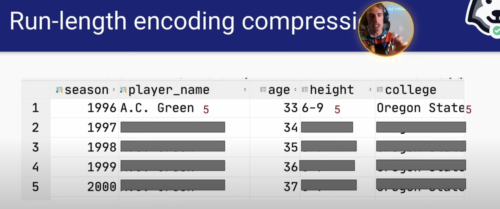

# Data Engineering

# Data Modeling - Complex Data Types and Cumulation - Day 1 Lecture - DataExpert.io Free Boot Camp

[](https://www.youtube.com/watch?v=5U-BbZ9G_xU)

In this lecture we learn the basics of data dimanensional modeling.

## Knowing your data consumer

The first lecture of the boot camp was introduced, focusing on complex data types such as `struct` and `array`.

- An `array` is a list in a column.
- a `struct` is a table within a table.

These concepts were highlighted as crucial for building more compact data sets. These concepts were utilized at Airbnb to create an `array of struct` that effectively modeled the listing data availability of all Airbnbs on the platform, shrinking the data sets by over 95%. The power of this approach was emphasized, though it was noted that these complex data types have specific use cases and usability concerns, making them harder to query and work with.

It is important to know the data consumer as this is critical when modeling data.

- `Dimensions` are attributes of an entity, such as a `birthday`, `favorite food`, or city of residence. 
- `Identifier dimensions` uniquely identify an entity. Examples are `user IDs`, `social security numbers`, and `device IDs`.

- `Slowly changing dimensions`: Attributes that change over time, e.g., favorite food.
- `Fixed dimensions`: Attributes that do not change, e.g., birthday.

- `Importance of knowing the data consumer`: To suit the different needs of Analysts, engineers, models, or customers. This data might look different because of the different needs.
  
- `Data analysts / Data scientists`
  - Should be very easy to query. Not many complex data types
- `Other data engineers`
  - Should be compact and probably harder to query. Nested types are okay 
- `ML models`
  - Depends on the model and how its trained
- `Customers`
  - Should be a very easy to interpret such as charts

- OLTP vs. OLAP: Transactional vs. analytical processing.
  - `OLTP` (Online Transaction Processing): Focuses on transaction-oriented applications, emphasizing data normalization and minimizing duplication 
  - `OLAP` OLAP (Online Analytical Processing): Optimized for query performance, allowing for fast data retrieval without extensive joins.

NB: modelling the data wrong will spell all minds of issues that affect speed and cost.


  - `Master Data`: Serves as a middle ground between OLTP and OLAP, providing a complete and normalized view of data for analytical purposes.
 
- `Cumulative table design`: Holding historical data. It maintains a complete history of dimensions, allowing for the tracking of changes over time. They are created by performing a full outer join between today's and yesterday's data tables.

Cumulative Table Design

- Full Outer Join: This technique is used to merge data from two different time periods (e.g., yesterday and today) to capture all records, even if they exist in only one of the datasets. This allows for a comprehensive view of user activity over time.
- Historical Data Tracking: The cumulative table design is essential for maintaining historical user activity data. For instance, Facebook utilized a table called "Dim All Users" to track user activity daily, which helped in analyzing user engagement metrics.
- State Transition Tracking: This involves categorizing user activity states (e.g., churned, resurrected, new) based on their activity from one day to the next. This method allows for detailed analysis of user behavior transitions.
- Cumulative Metrics: By holding onto historical data, analysts can compute various metrics, such as the duration since a user was last active. This can be done by incrementing a counter for inactive days.
- Data Pruning: To manage the size of the cumulative table, it is important to remove inactive users after a certain period (e.g., 180 days of inactivity) to maintain efficiency.
- Cumulative Table Design Process: The design involves using two data frames (yesterday's and today's data) to build a comprehensive view. The process includes performing a full outer join, coalescing user IDs, and computing cumulative metrics.


- Core components
  - 2 dataframes (yesterday and today)
  - FULL OUTER JOIN the two data frames together
  - COALESCE values to keep everything around
  - Hang onto all of history
- Usages
  - Growth analytics at Facebook (dim_all_users)

- Strengths
  - Historical analysis without shuffle
    - Enables historical analysis without the need for complex group by operations, as all data is stored in a single row . 28:39 - 29:10
    - Facilitates scalable queries on historical data, which can often be slow when querying daily data 
- Drawbacks
  - Can only be backfilled sequentially
    - Backfilling data can only be done sequentially, which may slow down the process compared to parallel backfilling of daily data.
  - Handling PII data can be a mess since deleted/inactive users get carried forward.
    - Managing personally identifiable information (PII) can become complex, requiring additional filtering to remove inactive or deleted users
  

- Compactness vs. usability tradeoff: Balancing data size and ease of use.
  - Compactness vs. Usability: Using complex data types can lead to more compact datasets but may complicate querying.
  - Empathy in Data Modeling: Understanding the needs of data consumers (analysts, engineers, customers) is crucial for effective data modeling
  
- `The most usable tables usually`
  - Have no complex data types
  - Easily can be manipulated with WHERE and GROUP BY
  - They are analytics forcused
  - When analytics is the main consumer and the majority of consumers are less
technical.

- `The most compact tables (not human readable)`
  - Are compressed to be as small as possible and can't be queried directly until they're decoded.
  - for example those used in serving apps like online systems where latency and data volumes matter a lot. Consumers are usually highly technical.
  - They are software engineering focused, production data focused.
  
- `The middle-ground tables`
  - Use complex data types (e.g. `ARRAY`, `MAP` and `STRUCT`), making querying trickier but also more compacting.
  - Upstream staging/master data where the majority of consumers are other data
engineers.

- Structs: These are like tables within tables, allowing for different data types for keys and values.
  - Keys are rigidly defined, compression is good!
  - Values can be any type

- Maps: Maps require all values to be of the same type, which can lead to casting issues.
  - Keys are loosely defined, compression is okay!
  - Values all have to be the same type
  
- Arrays: Arrays are suitable for ordered datasets, and they can contain structs or maps as elements.
  - Ordinal
  - List of values that all have to be the same type

- Run Length Encoding: This technique compresses data by storing the value and the count of consecutive duplicates, which is particularly useful for temporal data.


- Data Sorting and Joins: Maintaining the order of data during joins is crucial for effective compression. If sorting is disrupted, it can lead to larger data sets than expected . 41:05 - 41:37  Using arrays can help preserve sorting during joins.


SQL practice

```sql
CREATE TABLE players(
  player_name TEXT,
  height TEXT,
  college TEXT,
  country TEXT,
  draft_year TEXT,
  draft_round TEXT,
  draft_number TEXT,
  season_stats season_stats[],
  current_season INTEGER,
  PRIMARY KEY(player_name,current_season)
)
```

NB:
The `COALESCE` function in PostgreSQL is used to return the first non-null value from a list of arguments.


-------------------

## Day 2 - Slowly Changing Dimensions and Idempotency

[](https://www.youtube.com/watch?v=emQM9gYh0Io)


A Slowly Changing Dimension (SCD) is an attribute that changes over time. For example, your favorite food might change from lasagna to curry over the years. Some dimensions, like your birthday, do not change, while others, like your favorite food, do. Properly modeling SCDs is crucial for maintaining data quality and ensuring idempotency in data pipelines.

### Importance of Idempotency

Idempotency ensures that data pipelines produce the same results regardless of when or how many times they are run. This is critical for maintaining data consistency and quality. Non-idempotent pipelines can lead to data discrepancies, making it difficult to troubleshoot and causing a loss of trust in the data.

### Key Concepts

1. **Idempotency Definition**: A function or pipeline that produces the same output when executed multiple times with the same input.
2. **Challenges with Non-Idempotent Pipelines**:
  - Produces different data on different runs.
  - Causes data discrepancies and trust issues.
  - Difficult to troubleshoot and maintain.

### Best Practices for Idempotent Pipelines

1. **Avoid `INSERT INTO` without `TRUNCATE`**: Use `MERGE` or `INSERT OVERWRITE` to prevent data duplication.
2. **Use Date Ranges**: Always include both start and end dates in queries to avoid processing unbounded data.
3. **Ensure Complete Inputs**: Check for all required inputs before running the pipeline to avoid incomplete data processing.
4. **Sequential Processing for Cumulative Pipelines**: Ensure cumulative pipelines process data sequentially to maintain consistency.

### Types of Slowly Changing Dimensions

1. **Type 0 (Fixed Dimensions)**: Dimensions that do not change, e.g., birthday.
2. **Type 1 (Latest Value)**: Only the latest value is stored, not recommended for analytics.
3. **Type 2 (Historical Tracking)**: Stores historical data with start and end dates, recommended for maintaining data history and idempotency.
4. **Type 3 (Current and Previous Values)**: Stores only the current and previous values, not suitable for frequently changing dimensions.

### Modeling SCD Type 2

- **Structure**: Each record has a start date and an end date. The current record has an end date far in the future (e.g., 9999-12-31).
- **Benefits**: Maintains historical accuracy and supports idempotent pipelines.
- **Example**: Tracking favorite food changes over time with start and end dates for each period.

### Practical Considerations

- **Incremental vs. Full Load**: Incremental loading processes only new data, while full load processes all data. Choose based on data size and processing requirements.
- **Balancing Efficiency and Value**: Focus on building efficient pipelines but prioritize tasks that add the most value to the business.

### Conclusion

Understanding and implementing idempotent pipelines and properly modeling slowly changing dimensions are essential skills for data engineers. These practices ensure data consistency, quality, and trust, ultimately leading to more reliable and maintainable data systems.


### Additional Notes

- **COALESCE Function**: Used in PostgreSQL to return the first non-null value from a list of arguments.
- **Run Length Encoding**: Compresses data by storing the value and the count of consecutive duplicates, useful for temporal data.

By following these guidelines and understanding the concepts of idempotency and slowly changing dimensions, you can build robust and reliable data pipelines that stand the test of time.

